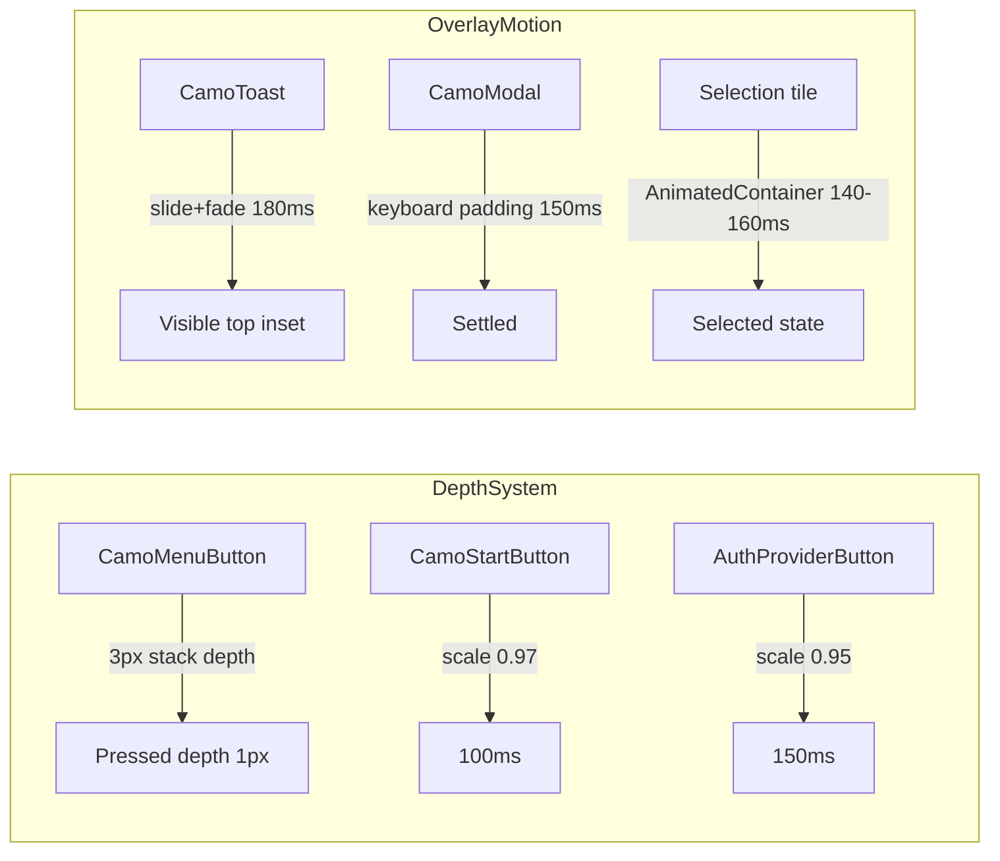
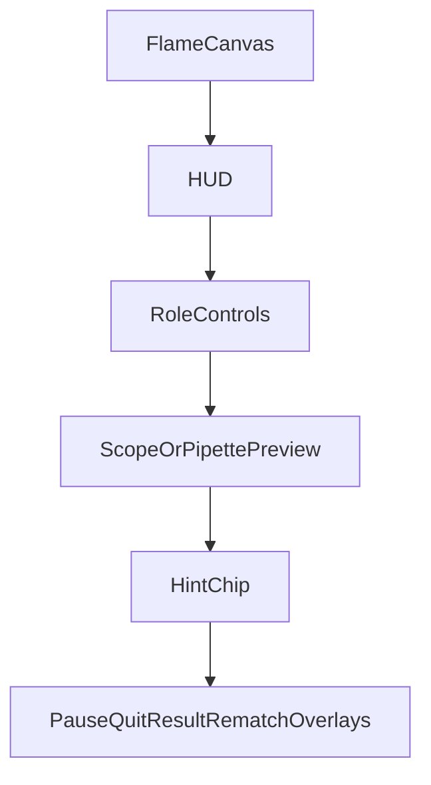
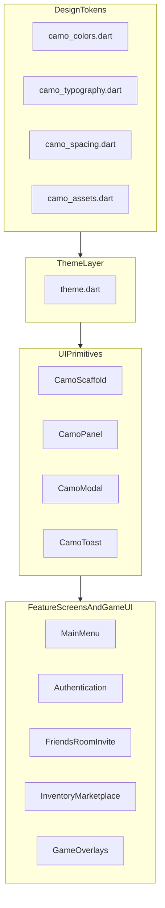

# Camo Design System

This document defines the full UI design system used in `chameleon_2d`, with exact values and implementation references for recreating the same look in another Flutter game.

## 1) Overview And Philosophy

- Visual identity: dark tactical arcade look, high-contrast accents, compact geometry, strong uppercase labels.
- Theme mode: dark only.
- Material: `ThemeData(useMaterial3: true)` with `ColorScheme.dark`.
- Typography strategy: locale-aware fonts (`ar` -> Cairo, default -> Rubik + Space Grotesk).
- Depth strategy: no `BoxShadow` token system; depth comes from layered button geometry, press scaling, scrims, and selective text shadows in game HUD.

Primary source files:

- [`/Users/mac/Development/chameleon_2d/lib/core/constants/camo_colors.dart`](/Users/mac/Development/chameleon_2d/lib/core/constants/camo_colors.dart)
- [`/Users/mac/Development/chameleon_2d/lib/core/constants/camo_typography.dart`](/Users/mac/Development/chameleon_2d/lib/core/constants/camo_typography.dart)
- [`/Users/mac/Development/chameleon_2d/lib/core/constants/camo_spacing.dart`](/Users/mac/Development/chameleon_2d/lib/core/constants/camo_spacing.dart)
- [`/Users/mac/Development/chameleon_2d/lib/core/constants/camo_assets.dart`](/Users/mac/Development/chameleon_2d/lib/core/constants/camo_assets.dart)
- [`/Users/mac/Development/chameleon_2d/lib/app/theme.dart`](/Users/mac/Development/chameleon_2d/lib/app/theme.dart)

## 2) Color System

### 2.1 Core Palette Tokens

| Token | Hex | Primary role |
|---|---|---|
| `background` | `#131316` | App/background base |
| `white` | `#FFFFFF` | White icon/text utility |
| `onBackground` | `#E4E1E5` | Text on dark base |
| `surface` | `#131316` | Surface base |
| `surfaceContainer` | `#1F1F22` | Panels/cards/chips |
| `surfaceVariant` | `#353438` | Borders/dividers/secondary fills |
| `primary` | `#92CCFF` | Link/accent text/icons |
| `primaryContainer` | `#3498DB` | Primary button fill |
| `onPrimaryContainer` | `#002D47` | Text on primary fill |
| `secondary` | `#FFDD74` | CTA/yellow economy accent |
| `secondaryFixedDim` | `#EEC209` | CTA border-side depth |
| `tertiary` | `#4AE183` | Success/online/gems |
| `onSurface` | `#E4E1E5` | Main content text |
| `onSurfaceVariant` | `#BFC7D2` | Muted text |
| `outlineVariant` | `#3F4850` | Input/tool outlines |

### 2.2 Semantic Colors Outside Core Tokens

| Value | Meaning | Typical location |
|---|---|---|
| `#E53935` | Error/danger/lose/seeker highlight | Toast error, result loss, seeker HUD |
| `#FF8A80` | Danger chip tint | Social/action chips |
| `#F0D45A` | Timer badge color | Game HUD |
| `#5CBF4A` | Hourglass icon | Game HUD |
| `#191C1D` | Google auth text | Auth provider button |
| `#C4C6CC` | Google auth border | Auth provider button |
| `#0F1C2C` | Apple auth fill | Auth provider button |

### 2.3 Overlay And Alpha Rules

| Pattern | Value |
|---|---|
| Modal barrier | black @ 65% |
| Force update blocker | black @ 75% |
| Loading blocker | `#CC000000` |
| CamoPanel non-opaque fill | `surfaceContainer` @ 92% |
| Scaffold background tint | `background` @ 50% |
| Main menu background tint | `background` @ 28% |

### 2.4 Game Paint Palette

`GamePaintPalette.colors`:

- `#1A3A2A`
- `#315C4A`
- `#4AE183`
- `#92CCFF`
- `#FFDD74`
- `#E8E8E8`
- `#8B5E3C`
- `#5C4033`
- `#3498DB`
- `#E74C3C`
- `#9B59B6`
- `#2C3E50`

Default paint selection in game: `#315C4A`.

### 2.5 Economy And Rarity Mapping

- Legendary -> `secondary` (`#FFDD74`)
- Epic -> `tertiary` (`#4AE183`)
- Rare -> `primary` (`#92CCFF`)
- Default -> `onSurfaceVariant` (`#BFC7D2`)

## 3) Typography System

Fonts come from `google_fonts`; no local `.ttf` declared in `pubspec.yaml`.

### 3.1 Families

- Default locales: Rubik for display/headline/body, Space Grotesk for caps labels.
- Arabic locale (`ar`): Cairo for all slots.

### 3.2 Canonical Text Styles (`CamoTypography`)

| Style | Locale | Size | Line height | Weight | Letter spacing | Other |
|---|---|---:|---:|---:|---:|---|
| `displayLg` | EN | 28 | 32/28 | 900 | -0.56 | italic |
| `displayLg` | AR | 28 | 32/28 | 800 | 0 | normal |
| `displaySm` | EN | 18 | 22/18 | 800 | 0 | normal |
| `displaySm` | AR | 18 | 22/18 | 700 | 0 | normal |
| `headlineMd` | EN/AR | 14 | 18/14 | 700 | 0 | normal |
| `bodyLg` | EN/AR | 13 | 16/13 | 500 | 0 | normal |
| `labelCaps` | EN | 10 | 12/10 | 700 | 0.8 | Space Grotesk |
| `labelCaps` | AR | 11 | 12/11 | 700 | 0 | Cairo |

### 3.3 Theme Slot Mapping

`ThemeData.textTheme` maps:

- `displayLarge`
- `headlineMedium`
- `bodyLarge`
- `labelLarge`

all with `onBackground` as base color.

### 3.4 Known Style Overrides

- `CamoStartButton`: `displaySm` modified to size `20`, letterSpacing `1.2`.
- `GameResultOverlay` title: upscaled to ~`28`, heavy weight.
- `GameHudOverlay` timer: custom large style (~`34`, letterSpacing `1.5`).

## 4) Spacing, Sizing, Radius, Border

### 4.1 Spacing Scale (`CamoSpacing`)

| Token | Value |
|---|---:|
| `xs` | 3 |
| `sm` | 6 |
| `md` | 10 |
| `lg` | 14 |
| `xl` | 20 |
| `hudMargin` | 20 |

### 4.2 Radius Rules

- Standard component radius: `sm` (6).
- Secondary common values: `md` (10), `xs` (3).
- Hardcoded contextual values appear in code: `4`, `16`, `20`, `999` (pill).

### 4.3 Border Width Rules

- Default border: `1`.
- Primary CTA/button borders: `1.5`.
- Selected rings/active avatar or map tile: `2`.

### 4.4 Key Component Dimensions

| Component | Value |
|---|---|
| `CamoMenuButton` minHeight | 42 |
| `CamoMenuButton` rest depth | 3 |
| `CamoMenuButton` pressed depth | 1 |
| `CamoMenuButton` press offset Y | 2 |
| `CamoStartButton` padding | 12 vertical, 16 horizontal |
| `GameToolButton` default size | 44 |
| Move controls button | 56 |
| Modal max width | 340 |
| Toast max width | 320 |
| Avatar sizes in app | 30/36/44 |
| Bottom nav item width | 72 |

## 5) Elevation, Depth, Motion

No unified shadow token. Main patterns:



### Motion Durations

- `CamoMenuButton`: 100ms `easeInOut` for translation/depth.
- `CamoStartButton`: 100ms scale interaction.
- Auth buttons: 150ms scale interaction.
- Toast: 180ms slide/fade.
- Modal keyboard adaptation: 150ms.
- Map/role tile selection: 140-160ms.

### Shadow Usage

- No `BoxShadow` token usage in app UI shell.
- Material elevation appears on auth pills (`elevation: 1`, `shadowColor: Colors.black26`).
- Game HUD uses text shadow blur for legibility.

## 6) Layout Primitives

### 6.1 `CamoScaffold`

File: [`/Users/mac/Development/chameleon_2d/lib/core/widgets/camo_scaffold.dart`](/Users/mac/Development/chameleon_2d/lib/core/widgets/camo_scaffold.dart)

- Full-screen stack with branded background.
- SafeArea + header + expanding body.
- Optional floating action aligned bottom-right with `hudMargin`.

### 6.2 `CamoPageHeader`

- Left back interaction (`IconButton` or `TextButton.icon` when `backLabel` present).
- Title rendered uppercase with `labelCaps` in `secondary`.
- Optional trailing slot for right-side actions.

### 6.3 `CamoPanel`

- Fill: `surfaceContainer` (`opaque`) or alpha-tinted variant.
- Border: `surfaceVariant` (full or alpha).
- Radius: `sm` (6).
- Default padding: `md` (10).

### 6.4 `CamoModal`

File: [`/Users/mac/Development/chameleon_2d/lib/core/widgets/camo_modal.dart`](/Users/mac/Development/chameleon_2d/lib/core/widgets/camo_modal.dart)

- Centered constrained panel (default max width 340).
- 65% black barrier.
- Keyboard-aware with animated padding.
- Shared input decoration helper: `camoModalFieldDecoration()`.

### 6.5 Screen Layout Skeletons

Main menu:

```text
+-----------------------------------------------------------+
| Header: ProfileChip                         Currency+Icons|
|                                                           |
|                      Skin Preview                         |
|                                                           |
| StartCluster (mode chip, START, private match)   NavRail |
| Version Badge                               Friends FAB   |
+-----------------------------------------------------------+
```

Auth:

```text
+-----------------------------+-----------------------------+
| Logo + brand copy           | Google / Apple / Guest CTAs|
| Subtitle                    | Max width panel            |
| Language picker             | Terms + Privacy footer     |
+-----------------------------+-----------------------------+
```

Matchmaking:

```text
+-----------------------------------------------------------+
| Header                                                     |
| [Mode column] [Role column] [Map picker column]          |
|-----------------------------------------------------------|
| Summary chip                             START button     |
+-----------------------------------------------------------+
```

Shop/Inventory:

```text
+-----------------------------------------------------------+
| Left rail tabs | Selected item panel | Responsive grid   |
+-----------------------------------------------------------+
```

Game overlay stack:

```text
+-----------------------------------------------------------+
| HUD top-center                                             |
|                                                           |
|                      Flame canvas                         |
|                                                           |
| Move controls (left)      Tool controls (right)          |
| Hint chip bottom-center                                   |
| Modal overlays / result / rematch when active            |
+-----------------------------------------------------------+
```

## 7) UI Component Catalog

Each component entry includes purpose, file, style rules, props.

### 7.1 Core Components

#### `CamoScaffold`
- File: `lib/core/widgets/camo_scaffold.dart`
- Purpose: standard app page shell.
- Props: `title`, `body`, `trailing?`, `floatingAction?`, `onBack?`, `backLabel?`.

#### `CamoPageHeader`
- File: `lib/core/widgets/camo_scaffold.dart`
- Purpose: title and navigation affordance.
- Props: `title`, `trailing?`, `onBack?`, `backLabel?`.

#### `CamoPanel`
- File: `lib/core/widgets/camo_scaffold.dart`
- Purpose: reusable card/panel container.
- Props: `child`, `padding?`, `opaque`.

#### `CamoModal`, `CamoModalContent`, `CamoModalActions`
- File: `lib/core/widgets/camo_modal.dart`
- Purpose: standard dialog surface/actions.
- Notable API: `showCamoModal`, `camoModalFieldDecoration`.

#### `CamoToastCard`, `CamoToastMessage`
- File: `lib/core/widgets/camo_toast.dart`
- Purpose: global transient feedback.
- Notable API: `showCamoToast`, `hideCamoToast`.

#### `PlayerCard`, `PlayerAvatar`, `PlayerActionChip`, `CamoEmptyState`
- File: `lib/core/widgets/player_card.dart`
- Purpose: social lists, friend rows, request rows.

#### `PaintedAvatar`
- File: `lib/core/widgets/profile_avatar_view.dart`
- Purpose: deterministic avatar painter view.

### 7.2 Buttons And CTAs

#### `CamoMenuButton`
- File: `lib/features/main_menu/widgets/camo_menu_button.dart`
- Visual: layered 3D button, depth simulation.
- Motion: 100ms translation/depth; press offset 2.
- Props: `label`, `onPressed`, `primary`, `backgroundColor?`, `foregroundColor?`, `icon?`.

#### `CamoStartButton`
- File: `lib/features/main_menu/widgets/camo_start_button.dart`
- Visual: yellow CTA, play icon, heavy text.
- Motion: 100ms scale to 0.97.
- Props: `label`, `onPressed`, `enabled`, `expandWidth`, `minWidth?`.

#### `MainMenuIconButton`
- File: `lib/features/main_menu/widgets/currency_chip.dart`
- Purpose: compact icon action button.

#### `AuthProviderButton`, `GuestPlayButton`
- File: `lib/features/authentication/widgets/auth_provider_buttons.dart`
- Purpose: auth entry buttons.
- Motion: 150ms scale interactions; auth pill elevation 1.

### 7.3 Menu And HUD Chrome

- `CurrencyHud` (`currency_chip.dart`)
- `PlayerProfileChip` (`player_profile_chip.dart`)
- `FriendsFab` (`friends_fab.dart`)
- `CamoOpsLogo` (`main_menu_header.dart`)
- `AppVersionLabel` / `AppVersionBadge` (`app_version_label.dart`)

### 7.4 Settings Components

- `SettingsSection`
- `SettingsSwitch`
- `SettingsAction`
- `ControlSchemePicker`
- `SettingsStepper`
- `GameSettingsPanel`

File: `lib/features/settings/widgets/game_settings_panel.dart`.

### 7.5 Game Control Components

- `GameToolButton`
- `GamePaintControls`
- `GameBrushSizeControls`
- `GameSeekerControls`
- `GameMoveControls`
- `GameJoystickControls`
- `GameColorPickerSheet`
- `GameHudOverlay`

Files under `lib/game/components/overlays/`.

### 7.6 Game Overlay Components

- `GameMenuOverlay`
- `GameQuitConfirmOverlay`
- `GameResultOverlay`
- `RematchWaitingOverlay`
- `GameScopeOverlay`
- `GamePipetteScope`

### 7.7 Shop/Inventory Pattern Components

- `_LeftRail` pattern
- `_SelectedItemCard` pattern
- `_ItemGrid` / `_ShopTile` patterns
- `ChameleonSkinPreview` (`lib/game/components/player/chameleon_skin_preview.dart`)

### 7.8 Social / Invite Pattern Components

- `PlayerActionChip`
- `CamoEmptyState`
- `_RoomInviteToast` (`room_invite_listener.dart`)

## 8) Screen-By-Screen Layouts (Routes)

Route definitions: [`/Users/mac/Development/chameleon_2d/lib/app/routes.dart`](/Users/mac/Development/chameleon_2d/lib/app/routes.dart)

| Route | Screen | Core layout |
|---|---|---|
| `/` | Main menu | Background + center preview + START cluster + nav rail |
| `/auth` | Authentication | Split brand/auth controls |
| `/matchmaking` | Matchmaking | 3-column selection + bottom start bar |
| `/create-room` | Room lobby | Left room panel, right members panel |
| `/game` | Game | Flame canvas + Flutter overlays |
| `/profile` | Profile | Left preview, right account/stats |
| `/match-history` | History | Data rows + result ribbons |
| `/friends` | Friends | Search/add + tabs + roster cards |
| `/invite` | Invite | Reward and referral actions |
| `/inventory` | Inventory | Left rail + owned cosmetics grid |
| `/marketplace` | Marketplace | Left rail + store listing + buy flow |
| `/leaderboard` | Leaderboard | Placeholder coming soon |
| `/settings` | Settings | Stacked section panels |

### 8.1 Navigation Flow

```mermaid
flowchart TD
  coldStart[ColdStart] -->|notSignedIn| auth[/auth]
  coldStart -->|signedIn| main[/]

  main --> mm[/matchmaking]
  main --> inventory[/inventory]
  main --> market[/marketplace]
  main --> leaderboard[/leaderboard]
  main --> invite[/invite]
  main --> friends[/friends]
  main --> profile[/profile]
  main --> settings[/settings]
  main --> createRoom[/create-room]

  profile --> history[/match-history]
  mm --> game[/game]
  createRoom --> game
  game --> main
  settings -->|signOut| auth
```

## 9) Game UI System

Game UI is split:

- Base layer: Flame-rendered gameplay canvas.
- Overlay layer: Flutter widgets and modals.

### 9.1 HUD And Controls

- HUD top-center: hider slots, timer cluster, seeker slots.
- Left-bottom: movement controls (buttons or joystick).
- Right-bottom:
  - Hider: paint/undo/brush/pipette tools.
  - Seeker: scope action.
- Bottom-center: contextual hint chip.

### 9.2 Overlay Priority



### 9.3 Phase-Driven UI Matrix

| Phase | Role | Main UI behavior |
|---|---|---|
| `hidePrep` | Hider | Paint tools and camouflage guidance |
| `hidePrep` | Seeker | Seeker actions locked; wait hint |
| `seek` | Hider | Evasion guidance, movement emphasis |
| `seek` | Seeker | Scope enabled, hunt guidance |

### 9.4 Custom Painter Catalog

- `_PlayerSlotPainter`
- `_HourglassPainter`
- `_ScopeCrosshairPainter`
- `_PipetteScopePainter`
- `_ChameleonSkinPainter`
- `_AvatarCanvasPainter`
- `_RibbonPainter`

## 10) Assets And Icons

### 10.1 Registered Flutter Assets

From `pubspec.yaml`:

- `.env`
- `.env.example`
- `assets/logo.png`
- `assets/icon.png`
- `assets/background/`

Background files:

- `assets/background/background.png`
- `assets/background/wall.png`
- `assets/background/chameleon.png`
- `assets/background/blackwhite.jpg`
- `assets/background/horse.jpg`

Mapped constants in `camo_assets.dart`.

### 10.2 Icon System

- Primary icon source: Material Icons (`uses-material-design: true`).
- OAuth logos: inline SVG strings via `flutter_svg`.
- Many game symbols: custom painters, not icon packs.

### 10.3 Procedural Art

Character skins, avatar portraits, and several HUD glyphs are code-drawn using `CustomPaint`; they are not static image assets.

## 11) Flutter Implementation Guide (For New Game)

### 11.1 Copy Core Token And Theme Files

Copy:

- `lib/core/constants/camo_colors.dart`
- `lib/core/constants/camo_typography.dart`
- `lib/core/constants/camo_spacing.dart`
- `lib/core/constants/camo_assets.dart`
- `lib/app/theme.dart`

### 11.2 Wire Locale-Aware Typography

Set locale code before app theme build:

```dart
void applyLocale(Locale locale) {
  CamoTypography.setLocaleCode(locale.languageCode);
}
```

### 11.3 Use Theme Builder

```dart
MaterialApp.router(
  theme: buildAppTheme(locale: locale),
  // ...
)
```

### 11.4 Adopt Layout Primitives First

Copy and standardize around:

- `CamoScaffold`
- `CamoPanel`
- `CamoModal`
- `CamoToast`

### 11.5 Copy-Paste Snippet: CamoPanel Decoration

```dart
decoration: BoxDecoration(
  color: opaque
      ? CamoColors.surfaceContainer
      : CamoColors.surfaceContainer.withValues(alpha: 0.92),
  borderRadius: BorderRadius.circular(CamoSpacing.sm),
  border: Border.all(
    color: opaque
        ? CamoColors.surfaceVariant
        : CamoColors.surfaceVariant.withValues(alpha: 0.6),
  ),
)
```

### 11.6 Copy-Paste Snippet: 3D Button Depth Pattern

```dart
static const _restDepth = 3.0;
static const _pressedDepth = 1.0;
static const _pressOffset = 2.0;

AnimatedContainer(
  duration: const Duration(milliseconds: 100),
  curve: Curves.easeInOut,
  transform: Matrix4.translationValues(0, pressed ? _pressOffset : 0, 0),
  padding: EdgeInsets.only(bottom: pressed ? _pressedDepth : _restDepth),
)
```

### 11.7 Dependencies To Replicate

Required for visual parity:

- `google_fonts`
- `flutter_svg`
- Material icons (`uses-material-design: true`)

Also used in this app architecture:

- `flame`
- `flutter_riverpod`
- `go_router`

## 12) Known Gaps And Porting Risks

- No light-theme spec exists.
- No unified token file for radius/border widths (mixed constants + hardcoded values).
- Some HUD typography bypasses `CamoTypography`.
- Some auth-specific colors are local to widgets instead of tokenized.
- `flame_audio` dependency exists but no audio assets or active integration.
- `cupertino_icons` dependency exists but no practical usage in UI.
- Orphan files on disk not declared in assets list:
  - `assets/banner.png`
  - `assets/logo-old.png`
  - `assets/logo-512.png`

## Appendix A) Architecture Summary



